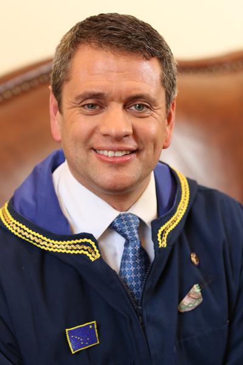

Hard work, dedication and the will to succeed are the values that pioneered Alaska and the values that guide my life, personally, professionally, as a parent, and as a volunteer. When my son, Devon, was born 26 years ago, I realized I was responsible for his future. Ever since, I have devoted my energy to making Alaska a place where our families flourish and our children grow up with opportunities.

I’ve learned quite a bit about these pioneer values over the years, and I attribute much of this knowledge and experience to my son and daughter and my experience serving Alaska. 
I came to Alaska as a young boy. After a winter in Tanana,we – my mom, younger brother, and I – moved to Anchorage. I have lived in South Anchorage for over 49 years. From an early age, I knew Alaska was where I was going to raise a family.

After graduating from Dimond High in 1984, I attended Arizona State University, and then became an electrician after attending the Alaska Joint Electrical Apprenticeship Training Program. I went on to become an instructor at the apprenticeship school and attended the University of Tennessee’s National Training Institute.
I worked for over 20 years in the private sector as an electrician, project manager, and trades instructor. I then worked for 17 years as a business representative for the International Brotherhood of Electrical Workers, a job which allowed me to help working families throughout Alaska. I now own my own business, Tuck Services, a project consultant company servicing the construction industry.

For the last two decades, I have been honored to guide education and workforce training with numerous organizations, including as former co-chair of Putting Alaska’s Resources to Work. That proved a natural segue to serving on the Anchorage School Board (2007- 2009). That was when you, my neighbors, elected me to represent you in the State House. 
As part of my public service, I’ve remained deeply involved with my family, church, and our community. My faith is an enormous source of strength and inspiration. I have volunteered as a Soccer Coach for Boys and Girls Club and with Anchorage Youth Court, Habitat for Humanity, Christmas in May, and Proyecto Fe Guatemala Mission Trips.
Alaska is my home. What I love most is the people. My passion is working to build a better Alaska, for our future. It is an honor and privilege to serve you. <strong>I’m asking for your vote on November 3rd.</strong>

Thanks!
