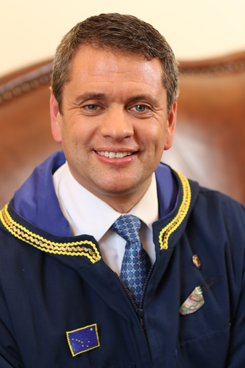

It is an honor to represent you. Your continued trust and faith has enabled me to bring people together
to serve as House Majority Leader of a coalition of Alaska Republicans, Independents, and Democrats.
We put aside party politics and joined together to do what’s best for Alaska by protecting jobs and
building the economy.

We passed legislation that addressed immediate public safety concerns and increased funding for
troopers and the court system, and I am proud we pushed for advancements in victims’ rights and
forward funded education.

Keeping Alaskans safe is my top priority. Unfortunately, many of us have been victims of the recent
increase in crime. Like many of you, my family has had vehicles stolen and items taken from our
property. Alaskans have a right to feel safe in their neighborhoods.

I introduced bills and amendments to protect the Permanent Fund Dividend and give Alaskans a vote to
constitutionalize the Dividend for our future children.

I personally passed legislation that supported our military service members and veterans, ensured that
small business could continue to operate without harmful regulations, and provided economic
opportunities along Alaska’s Arctic coast.

Alaska is blessed with talented people and incredible natural resources. Together, we can make Alaska a
place where ideas and innovations flourish, education is of the highest quality, the economy thrives, and
jobs are rewarding. I want to continue working for you. Please call me with your concerns and vote for
me, Chris Tuck. 223-6474.